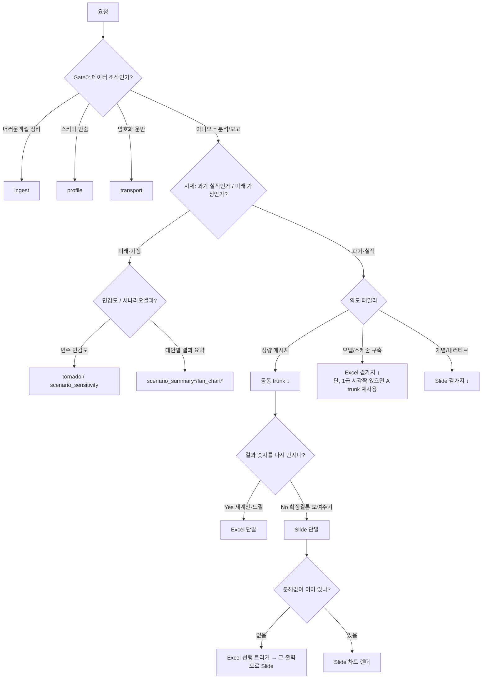

# 차트/양식 라우팅 가이드

> **목적**: FP&A 에이전트가 "이 상황 → 어떤 양식" 헷갈리지 않게. 상황을 위→아래 cascade로 좁힌다.
> **권위 (claude R2)**: `dispatcher.py`(텍스트 키워드)·`inference.py`(데이터키 매칭) 출력은 **advisory 신호**다. 최종 라우팅 권한은 **에이전트의 본 가이드 판독**에 있다. 차트 id 어휘는 `inference.py`의 등록 이름이 **SSOT** — 본 가이드의 모든 id는 그 이름을 참조만 한다(드리프트 시 inference 이름 우선).

## 0. Gate 0 — 진입 게이트 (양식 문제 아님)
`classify_stage` 영역. ingest/profile/transport면 Excel 운영경로로 빼고 종료. 그 외 = analysis → 시제 게이트.

## 1. 시제 게이트 (★자문 R3 핵심 — tornado 오라우팅 차단)
- **미래·가정** ("어떤 가정이 결과를 흔드나", "민감도", "시나리오 결과") → `tornado`(변수 민감도) / `scenario_summary*`·`fan_chart*`(대안 결과·불확실성 띠) ※`*`=미구현 신규
- **과거·실적** ("실제로 왜 바뀌었나") → 의도 패밀리(↓)

## 2. 의도 패밀리 A — 정량 메시지 (공통 trunk)
공통가지 = 배타 아닌 **순차 파이프라인**. "결과 숫자 다시 만지나? Y→Excel / N→Slide". Slide경로에 분해값 없으면 Excel 선행.

### 2-1. 변동분해 cascade (과거·실적 한정)
1. 항목별 차이 **목록·표** 중심? → `variance_table` (Excel: variance)
2. 시작→끝 **누적 증감 다리**? → `waterfall` (Excel: variance / fc_variance_bridge)
3. **가격·물량·믹스 3분해**? → `pvm_bridge` (Excel: pvm_bridge)

### 2-2. 목표대비/KPI cascade
- 단일 + 목표·구간 맥락 **없음** → `big_number`
- 단일 + 밴드 내 정밀판독 핵심 → `bullet` (gauge는 잉크효율 비판 → 비권장, ★R3)
- 다수 + 단위 제각각, 헤드라인 숫자(+델타/스파크) → `kpi_dashboard` / `dashboard_kpi`
- 다수 + 공유 목표구조 + 크기/거리 판독 → `bullet` (실적막대·목표마커·평가밴드)
- 다수 + 판정만(R/A/G) → `scorecard`
- 변별 단일질문: "크기·목표거리를 읽어야 하나(bullet) / 판정만(scorecard) / 단위이질 타일(kpi_dashboard)"

### 2-3. 시계열 (2×2)
| | 구성분해 No | 구성분해 Yes |
|---|---|---|
| 추세(연속·다기간) | `line_chart` | `stacked_area` |
| 크기(이산·소기간) | `column_historic_forecast` | `stacked_column` |
- 롤링 전망: 변경분(vintage delta)이 메시지면 다중선/forecast bridge, 단순추세면 line (Excel: rolling_forecast)
- 계절성(YoY 패턴): `overlapping_line*`(연도 겹친 선) ※미구현 (gemini R3)

### 2-4. 코호트 / 순위 / 구성 / 분포
- 코호트 잔존 그리드(행=코호트, 열=경과기간) → `cohort_heatmap` (Excel: cohort_retention)
- 집중도 80:20 → `pareto` / 순서만 → `horizontal_bar`
- 단일 구성비: 중앙 총계 필요 → `donut` / 아니면 `pie` / **>5~6 카테고리면 bar 폴백**(가드레일)
- 구성비 비교(기간·세그먼트) → `stacked_column`(100%)
- 2변수 상관(조업도×원가 등) → `scatter*` / 3변수 → `bubble` ※scatter 미구현

## 3. 의도 패밀리 B — 모델/스케줄 구축 (Excel 주력)
계산은 Excel, **단 1급 시각짝이 있으면 A trunk의 Slide 단말 재사용** (★R3 — "요약만" 아님):
| Excel 모델 | Slide 시각짝 |
|---|---|
| headcount_plan (기초→입사→퇴사→기말) | `waterfall` (헤드카운트 브리지) |
| cashflow_13w (잔액 추세) | `line_chart` / area |
| fc_maturity_wall (연도별 만기) | `stacked_column` |
| debt_schedule (잔액 런오프) | `line_chart` / area |
| investment_appraisal (NPV 민감도) | `tornado` / 회수기간 line |
| dupont_roic / unit_economics / fc_driver_unitcost | `driver_tree*` ※미구현 |
순수 계산 전용(슬라이드 불필요): fc_lease_ifrs16, fc_depreciation, fc_allocation, fc_runrate, fc_prepaid, fc_cuttability, consolidation_fx, budget_build, working_capital, pnl_3statement.

## 4. 의도 패밀리 C — 개념/내러티브 (Slide 주력, Excel 불필요)
- **비교 cascade**: 개입 전/후 → `before_after` / 단일결정 장단 → `pros_cons` / 대안×속성 격자 → `comparison_table` / 2~3옵션 이질 패널 → `side_by_side`
- **매트릭스**: 축없는 4버킷 → `swot` / 가능성×영향 → `risk_matrix` / 성장×점유 → `bcg_matrix` / 임팩트×노력 → `prioritization_matrix` (그 외 2×2는 generic)
- **프로세스**: 단계마다 수량감소 → `funnel` / 순서만 → `phases_chevron`·`vertical_steps` / 위계 → `pyramid` / 순환 → `cycle` / 가치사슬 → `value_chain`
- **일정**: 의존성 작업막대 → `gantt_timeline` / 웨이브 → `waves_timeline` / 마일스톤 점 → `timeline`
- **기타**: org_chart, table_insight, quote, venn, temple, two_stat~five_key_areas

## 5. 구조 슬라이드 (덱 골격)
cover · section_divider · toc · executive_summary · key_takeaway · closing · appendix_title · dark_navy_summary

## 6. 공통가지 핸드오프 계약 (★R3 — Excel 출력 spec → Slide 입력 spec)
- **scenario_sensitivity → tornado**: Excel은 **one-way 민감도** `[{var, base, low, high, delta=|high-low|}]` 정렬 출력 (2-way data table은 tornado가 못 먹음).
- **fc_variance_bridge → waterfall**: ordered signed step list `[{label, delta, is_total}]` + running cumulative.
- **board_kpi_pack → bullet/scorecard/kpi_dashboard**: 상위집합 `{kpi, actual, target, band_lo, band_hi, unit, rag_threshold, spark?}` (bullet=band, scorecard=rag, dashboard=unit/spark 소비).
- **pvm_bridge ↔ pvm_bridge**: 버킷·부호 고정 `{start, volume, price, mix, (fx/other?), end}`.
- **대형 Excel(budget_build/pnl_3statement 등)**: 전체 파일 던지지 말고 **"Slide Export Range"(명명범위) 2D 배열**만 스크래핑 (gemini R3).

## 7. 신규 구현 완료 (자문 R3 발견 커버리지 구멍 → 충전, 2026-06-13)
모두 `design-system/mck/assets/`에 JS 렌더러 + `_review/`에 검증 스크린샷.
| 차트 id | 상황 | 파일 | 갤러리 |
|---|---|---|---|
| `combo` | 매출막대 + 마진%선 (두 척도 동시) | combo.js | 5-combo.png |
| `driver_tree` | 매출=물량×단가·DuPont 시각분해 | driver-tree.js | 6-driver-tree.png |
| `scatter` | 조업도×원가 상관 + 회귀선 (histogram 흡수) | scatter.js | 7-scatter.png |
| `scenario_summary` | Base/Up/Down 대안별 KPI 결과 | scenario-summary.js | 8-scenario.png |
| `overlapping_line` | 계절성 YoY 겹친 선 | overlapping-line.js | 9-overlapping.png |
| `heatmap` | 부서×월 변동률 (발산 색) | heatmap.js | 10-heatmap.png |
| `treemap` | 계층 비용 구성 (squarified) | treemap.js | 11-treemap.png |
| `breakeven` | CVP 손익분기점 | breakeven.js | 12-breakeven.png |
| (기존) `bullet`·`tornado`·`pvm_bridge`·`cohort_heatmap` | — | *.js | 1~4.png |

> 본문 cascade의 `*` 마커(미구현)는 위 구현으로 모두 해소. fan_chart(P10/50/90 띠)만 scenario_summary로 대체 — 추후 필요 시 별도.
